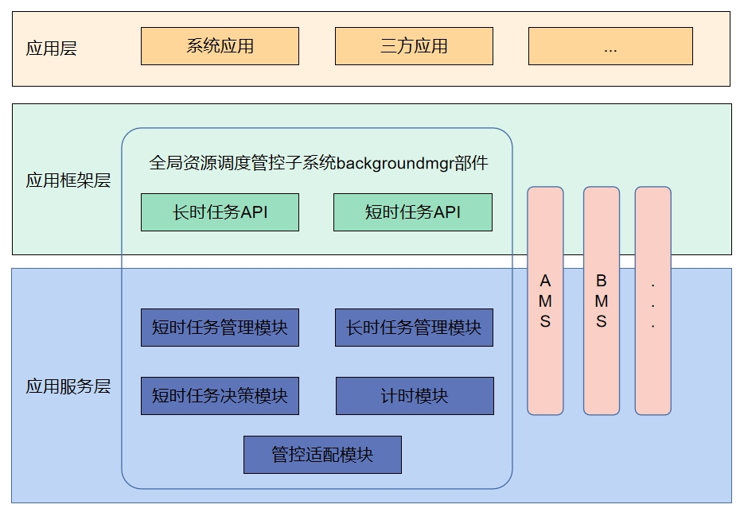

# 后台任务管理

-   [简介](#section11660541593)
-   [目录](#section161941989596)
-   [短时任务](#section1312121216216)
    -   [接口说明](#section114564657874)
    -   [使用说明](#section129654513264)
        -   [短时任务使用约束](#section1551164914237)
-   [长时任务](#section18532577761)
    -   [接口说明](#section19389218787)
    -   [使用说明](#section17228995140)
        -   [长时任务使用约束](#section18958419455)

-   [相关仓](#section1371113476307)

## 简介<a name="section11660541593"></a>

在资源调度子系统中后台任务管理负责管理后台任务，并提供后台任务的申请、取消和查询等接口。



## 目录<a name="section161941989596"></a>

```
/foundation/resourceschedule/background_task_mgr
├── frameworks       # 接口实现
├── interfaces
│   ├── innerkits    # 对内接口目录
│   └── kits         # 对外接口目录
├── sa_profile       # 组件服务配置
├── services         # 组件服务实现
└── utils            # 组件工具实现

```
## 短时任务<a name="section1312121216216"></a>

### 接口说明<a name="section114564657874"></a>

| 接口名                                                                                   | 接口描述     |
|------------------------------------------------------------------------------------------|-------------|
| function requestSuspendDelay(reason:string, callback:Callback\<void>): DelaySuspendInfo; | 申请延迟挂起 |
| function cancelSuspendDelay(requestId:number): void;                                     | 取消延迟挂起 |
| function getRemainingDelayTime(requestId:number, callback:AsyncCallback\<number>):void;  | 获取延迟挂起剩余时间（callback形式） |
| function getRemainingDelayTime(requestId:number): Promise\<number>;                      | 获取延迟挂起剩余时间（Promise形式） |

### 使用说明<a name="section129654513264"></a>

退到后台的应用有不可中断且短时间能完成的任务时，可以使用短时任务机制，该机制允许应用在后台短时间内完成任务，保障应用业务运行不受后台生命周期管理的影响。

- 注意：短时任务仅针对应用的临时任务提供资源使用生命周期保障，限制单次最大使用时长为3分钟，全天使用配额默认为10分钟（具体时长系统根据应用场景和系统状态智能调整）。

#### 短时任务使用约束<a name="section1551164914237"></a>

- **申请时机**：允许应用在前台时，或退后台在被挂起之前（应用退到后台默认有6~12秒的运行时长，具体时长由系统根据具体场景决定）申请延迟挂起，否则可能被挂起（Suspend），导致申请失败。
- **超时**：延迟挂起超时（Timeout），系统通过回调知会应用，应用需要取消对应的延迟挂起，或再次申请延迟挂起。超期不取消或不处理，该应用会被强制取消延迟挂起。
- **取消时机**：任务完成后申请方应用主动取消延时申请，不要等到超时后被系统取消，否则会影响该应用的后台允许运行时长配额。
- **配额机制**：为了防止应用滥用保活，或者申请后不取消，每个应用每天都会有一定配额（会根据用户的使用习惯动态调整），配额消耗完就不再允许申请短时任务，所以应用完成短时任务后立刻取消延时申请，避免消耗配额。（注，这个配额指的是申请的时长，系统默认应用在后台运行的时间不计算在内。）

## 长时任务<a name="section18532577761"></a>

### 接口说明<a name="section19389218787"></a>

| 接口名                                                                                   | 接口描述     |
|------------------------------------------------------------------------------------------|-------------|
| function startBackgroundRunning(context: Context, bgMode: BackgroundMode, wantAgent: WantAgent, callback: AsyncCallback&lt;void&gt;): void; | 服务启动后，向系统申请长时任务，使服务一直保持后台运行（callback形式） |
| function startBackgroundRunning(context: Context, bgMode: BackgroundMode, wantAgent: WantAgent): Promise&lt;void&gt;;                       | 服务启动后，向系统申请长时任务，使服务一直保持后台运行（promise形式） |
| function stopBackgroundRunning(context: Context, callback: AsyncCallback&lt;void&gt;): void;                                                | 停止后台长时任务的运行（callback形式） |
| function stopBackgroundRunning(context: Context): Promise&lt;void&gt;;                                                                      | 停止后台长时任务的运行（promise形式） |

### 使用说明<a name="section17228995140"></a>

长时任务给用户能够直观感受到的且需要一直在后台运行的业务提供后台运行生命周期的保障。比如：业务需要在后台播放声音、需要在后台持续导航定位等。此类用户可以直观感知到的后台业务行为，可以通过使用长时任务对应的后台模式保障业务在后台的运行，支撑应用完成在后台的业务。

OpenHarmony提供了九种后台模式，供需要在后台做长时任务的业务使用

| BackgroundMode | 接口参数 | 说明 | 通知栏显示提示 | 备注 |
| -------- | -------- | -------- | -------- | -------- |
| dataTransfer | DATA_TRANSFER | 通过网络/对端设备进行数据下载、备份、分享、传输等 | 正在运行数据传输任务 |  |
| audioPlayback | AUDIO_PLAYBACK | 音频输出 | 正在运行音频播放任务 |  |
| audioRecording | AUDIO_RECORDING | 音频输入 | 正在运行录音任务 |  |
| location | LOCATION | 定位、导航 | 正在运行定位任务 |  |
| bluetoothInteraction | BLUETOOTH_INTERACTION | 蓝牙传输 | 正在运行蓝牙相关任务 |  |
| multiDeviceConnection | MULTI_DEVICE_CONNECTION | 分布式互联任务 | 正在运行分布式任务 |  |
| wifiInteraction | WIFI_INTERACTION | WLAN传输 | 正在运行WLAN相关任务 | SystemApi，仅对System权限应用开放 |
| voip | VOIP | 音视频电话、VOIP | 正在运行通话相关任务 | SystemApi，仅对System权限应用开放 |
| taskKeeping | TASK_KEEPING | 计算任务 | 正在运行计算任务 | 仅在特定设备生效 |

#### 长时任务使用约束<a name="section18958419455"></a>

- 如果用户选择可感知业务（如播音、导航、上传下载等），触发对应后台模式，在任务启动时，系统会强制弹出通知提醒用户。
- 如果任务结束，应用应主动退出后台模式。若在后台运行期间，系统检测到应用并未使用对应后台模式的资源，则会被挂起（Suspend）。
- 避免不合理地申请后台长时任务，长时任务类型要与应用的业务类型匹配。如果执行的任务和申请的类型不匹配，也会被系统检测到并被挂起（Suspend）。
- 长时任务是为了真正在后台长时间执行某个任务，如果一个应用申请了长时任务，但在实际运行过程中，并未真正运行或执行此类任务时，也会被系统检测到并被挂起（Suspend）。
- 每个Ability同一时刻只能申请运行一个长时任务。

## 相关仓<a name="section1371113476307"></a>

资源调度子系统

**background\_task\_mgr**

notification_ans_standard

notification_ces_standard

appexecfwk_standard

account_os_account